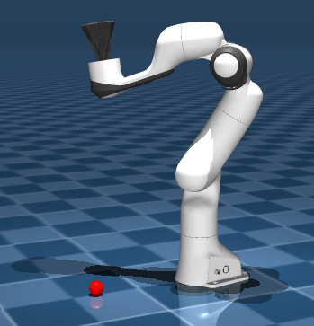

# Juggling-RL a Reinforcement Learning project

## Introduction
This project is inspired by the paper __Kai Ploeger, Michael Lutter and Jan Peters. High Acceleration Reinforcement Learning for Real-World Juggling with Binary Rewards,Conference on Robot Learning (CoRL), 2020.__

We implemented two different reinforcement learning approches in order to teach a mujoco robotic model how to juggle:
- The first approach was to use Direct Policy Search methods to optimise an expert policy we crafted
- The second was to use deep reinforcement learning to determine the optimal policy for juggling

## How to run
To run the project first install the following python dependencies using pip or conda depending on your environment:
- numpy
- matplotlib
- mujoco
- mediapy
- gymnasium
- tensorflow
- os
- visualkeras

Then clone the repository on your machine.

You will find two jupyter notebooks inside the __src__ directory:
- RL_DPS is our implementation using the Direct Policy Search Method
- RL_DDPG is our implementation using deep deterministic policy gradient

Simply run all the cells to see results.

## Paper
For more information about the implementation please refer to our paper.

